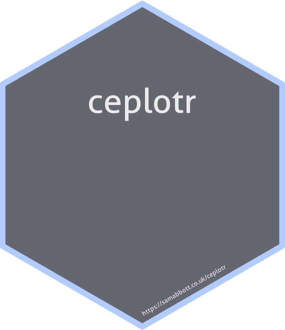

```{r, echo = FALSE}
knitr::opts_chunk$set(
  collapse = TRUE,
  comment = "#>",
  fig.path = "man/figures/"
)
```

# `{ceplotr}`: Model agnostic plotting for cost effectiveness analysis 

[](https://mybinder.org/v2/gh/seabbs/ceplotr/master?urlpath=rstudio) 
[](https://CRAN.R-project.org/package=ceplotr)
[](https://github.com/seabbs/ceplotr)
[](https://zenodo.org/badge/latestdoi/219757940)
[](https://cran.r-project.org/package=ceplotr)
[](https://cran.r-project.org/package=ceplotr)

**This package was outlined ahead of the HE Hackathon 2019 @Imperial. After a group discussion it was not continued in favour of aiming to improve documentation + testing for [BCEA](https://cran.r-project.org/web/packages/BCEA/index.html)** 

This package aims to: 

* Provide standarised modular plotting functions for cost effectiveness analysis.
* Support a single data format which is model and application agnostic.
* Provide data transformation tooling to support cost effectiveness analysis.
* Support converting model simulations, costs, etc. into this standard format. 
* Provide detailed documentation of all functionality. 
* Support interactive use via an interface.
* Be modular, user modfiable and extendable. 
* Be fully tested, reliable and easy to use. 


 For help getting started see the [Getting Started](https://www.samabbott.co.uk/ceplotr/articles/intro.html) vignette.

## Installation

Install the CRAN version (when released):

```{r cran-installation, eval = FALSE}
install.packages("ceplotr")
```

Alternatively install the development version from GitHub:

```{r gh-installation, eval = FALSE}
# install.packages("remotes")
remotes::install_github("seabbs/ceplotr")
```

## Documentation

[](https://www.samabbott.co.uk/ceplotr/)
[](https://www.samabbott.co.uk/ceplotr/dev)
[](https://www.samabbott.co.uk/ceplotr/articles/intro.html)
[](https://www.samabbott.co.uk/ceplotr/reference/index.html)


## Testing

[](https://travis-ci.org/seabbs/ceplotr)
[](https://ci.appveyor.com/project/seabbs/ceplotr)
[](https://codecov.io/github/seabbs/ceplotr?branch=master)

## Quick start

Lets get started quickly by 


See [Functions](https://www.samabbott.co.uk/ceplotr/reference/index.html) for more details of the functions used and for more package functionality.


## Shiny dashboard

```{r run-dash, eval = FALSE}
ceplotr::cd_dashboard()
```


## Contributing

File an issue [here](https://github.com/seabbs/ceplotr/issues) if there is a feature that you think is missing from the package, or better yet submit a pull request.

Please note that the `ceplotr` project is released with a [Contributor Code of Conduct](https://github.com/seabbs/ceplotr/blob/master/.github/CODE_OF_CONDUCT.md). By contributing to this project, you agree to abide by its terms.

## Citing 

If using `ceplotr` please consider citing the package in the relevant work. Citation information can be generated in R using the following (after installing the package),

```{r}
citation("ceplotr")
```

## Docker

This package has been developed in docker based on the `rocker/tidyverse` image, to access the  development environment enter the following at the command line (with an active docker daemon running),

```{bash, eval = FALSE}
docker pull seabbs/ceplotr
docker run -d -p 8787:8787 -e USER=ceplotr -e PASSWORD=ceplotr --name getTBinR seabbs/ceplotr
```

The rstudio client can be accessed on port `8787` at `localhost` (or your machines ip). The default username is ceplotr and the default password is ceplotr. Alternatively, access the development environment via [binder](https://mybinder.org/v2/gh/seabbs/ceplotr/master?urlpath=rstudio).

